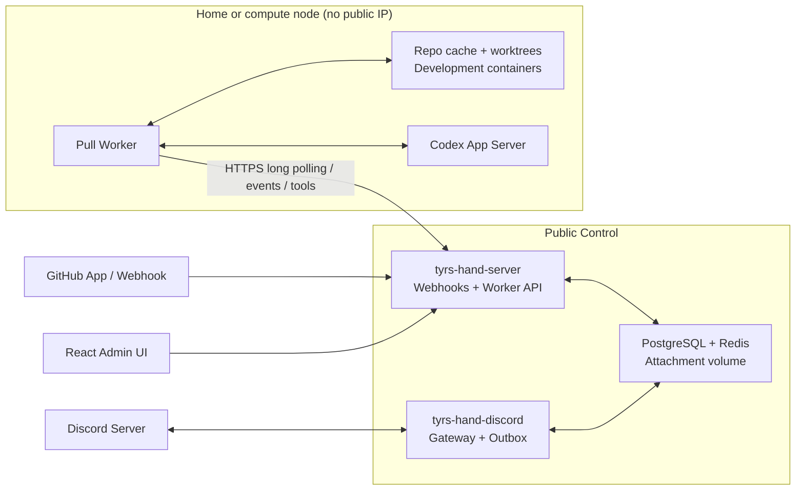

<p align="center">
  
</p>

<h1 align="center">Tyrs Hand</h1>

<p align="center"><a href="README.md">中文</a></p>

[](https://github.com/slovx2/tyrs-hand/actions/workflows/ci.yml)
[](https://github.com/slovx2/tyrs-hand/actions/workflows/security.yml)
[](LICENSE)

Tyrs Hand is a self-hosted GitHub and Discord agent control plane. GitHub tasks use isolated temporary worktrees for read-only or lightweight edits. Discord development forums use long-lived per-user development containers with persistent repository clones, Home directories, and Codex sessions.

The project is at an early stage. Evaluate it on controlled repositories before production use. The default agent profile can access the public network and write to its worktree, so review trigger rules, tool allowlists, and permission policies first.

## Highlights

- **Turn idle home computers into execution nodes.** Run the public Control on a small internet-facing server while powerful machines at home pull Codex work over HTTPS. Home networks need no public IP, port forwarding, or SSH reverse tunnel; Cloudflare remains optional. Route all new resources to one default node first, then add nodes and placement policies later.
- GitHub App identity with HMAC-verified and deduplicated webhooks
- PostgreSQL-backed durable jobs, leases, retries, and recovery
- One bare clone cache per repository and one temporary worktree per GitHub work item, removed seven days after closure
- Reusable Codex threads with durable summaries for context handoff
- Repository skills loaded from `.agents/skills/<name>/SKILL.md`
- GitHub MCP tools and controlled local Git dynamic tools
- Private Discord servers with long-lived development forums, GitHub task projections, and persistent conversations
- One reusable container and Home per Discord user, with one independent full clone per forum
- Idempotent tool calls keyed by `(thread, turn, call)`
- Natural Codex final answers with platform-owned control state and managed reply gates
- Public HTTPS Control and Pull Workers with frozen per-resource placement
- React administration UI for repositories, rules, profiles, jobs, threads, execution nodes, default placement, and audit logs

## Architecture



The project ships four commands:

- `tyrs-hand-server`: administration API, GitHub App, webhook receiver, and embedded frontend
- `tyrs-hand-worker`: pulls work through `/worker/v1` and runs workspaces, Codex, local Git, and development containers on an execution node
- `tyrs-hand-discord`: Discord gateway, forum conversations, projections, and outbox delivery
- `tyrs-hand-admin`: migrations, diagnostics, administrator recovery, key rotation, and garbage collection

PostgreSQL is the only authoritative state store. Redis contains only recoverable rate-limit and notification data. Workers connect to neither store directly and hold no Control master key or Discord bot token.

## Quick Start

### Requirements

- Docker Engine and Docker Compose
- Go `1.26.5`, Node.js `24.14.0`, and pnpm `11.14.0` for source development
- Codex CLI/App Server `0.145.0`; the application image already includes it

### Run Locally

1. Create local configuration and secrets:

   ```bash
   cp .env.example .env
   install -d -m 0700 .local/secrets
   printf '%s' 'tyrs_hand' > .local/secrets/postgres_password
   openssl rand -base64 32
   openssl rand -hex 32
   ```

   Put the generated values in `.env` as `TYRS_HAND_MASTER_KEY` and `TYRS_HAND_SETUP_TOKEN`. Local PostgreSQL uses `tyrs_hand` by default. In production, replace both `POSTGRES_PASSWORD` and the secret file with the same random password.

2. Build, migrate, and start the Control:

   ```bash
   docker compose build server
   docker compose up -d postgres redis
   docker compose --profile tools run --rm admin migrate
   docker compose up -d server discord
   ```

3. Open `http://localhost:8080/setup`, create the administrator, and store the TOTP secret and one-time recovery codes.

4. Create a GitHub App through the Manifest flow or enter an existing App manually. Install it on explicitly selected repositories.

5. Configure an OpenAI-compatible base URL, API key, model, and reasoning effort in system settings. Shared-account authentication is also available:

   ```bash
   docker compose --profile tools run --rm admin codex-login
   ```

6. A complete production deployment also creates an execution node in the admin UI and starts a Pull Worker with the separate `compose.worker.yaml`. See the [minimal installation guide](docs/deployment/minimal-installation.md) for enrollment, default placement, and IP/CIDR allowlisting.

## Optional Webhook Listener Separation

By default, the admin UI, internal API, and webhook receiver share `TYRS_HAND_HTTP_ADDR` and use one HTTP port.

To isolate webhooks at the network layer:

```dotenv
TYRS_HAND_SEPARATE_WEBHOOK=true
TYRS_HAND_WEBHOOK_HTTP_ADDR=:8081
```

When enabled, the admin listener no longer registers `/webhooks/github`. The webhook listener exposes only health endpoints and the GitHub webhook route. Your deployment must publish and route the second port separately.

## GitHub App Permissions

The default Manifest requests:

| Permission | Access |
| --- | --- |
| Metadata | Read |
| Contents | Read & Write |
| Issues | Read & Write |
| Pull Requests | Read & Write |
| Actions | Read |
| Checks | Read |

The Manifest subscribes to Repository, Issues, Issue Comment, Pull Request, Review, Review Comment, and Push events. GitHub sends installation lifecycle events automatically.

The default rules accept `/tyrs-hand` on the first line of an Issue or Pull Request comment, a visible exact `@mention` of the App login anywhere on that first line, and structured `tyrs-hand` label events. Mention matching is case-insensitive and ignores later lines, quotes, code, escapes, URLs, and username suffixes. Legacy full-body `@mention` matching remains available only as a disabled-by-default compatibility rule. Regular GitHub App bots cannot be selected directly as reviewers; administrators can explicitly add a `pull_request.review_requested` event rule when any reviewer request should trigger the agent.

## Threads, Skills, and Workspaces

- A `(Work Item, Agent Profile, Context Version)` tuple owns one Codex thread.
- Follow-up comments on the same Issue or Pull Request resume that thread.
- Provider, profile, tool schema, or skill changes create a new thread with a durable handoff summary.
- Each GitHub work item owns a temporary worktree and runs serially; it is removed seven days after closure.
- The GitHub path does not install or share dependencies and does not prepare toolchains. It is intended for read-only or lightweight edits, not local builds, execution, or debugging.
- Issue and PR URLs and numbers are injected into the prompt. PR source refs are fetched in advance, with source/target branches and SHAs included in context.
- Pull Requests created from Issues are linked back to the original work item.
- Failed jobs retain their workspace for recovery; untrusted state is quarantined and rebuilt.

## Discord Development Containers

An execution node with the `discord` role manages Discord development environments. The first release can use one default node for both GitHub and Discord work; it does not force a Discord-user-to-node binding. A development environment freezes the current default node when it is created, and its forums, conversations, and Codex controls keep using that node.

Only Workers with development containers enabled mount the host Docker socket. The socket is never exposed inside the agent's development container. Start the Worker with the separate Compose file:

```bash
docker compose -f compose.worker.yaml up -d worker
```

- A Discord user has one container, data volume, Home volume, and network per Guild. Forums for multiple repositories reuse that environment.
- The per-user container is the security boundary. Operator collaborators can drive the agent and must be trusted by the environment owner.
- The first forum's repository is the stable image source and must provide `.devcontainer/Dockerfile` on its default branch with a non-root final `USER`.
- Every forum has an independent full clone. Home, clones, and Codex sessions survive container, worker, and host restarts.
- Containers stop after 30 idle minutes. Explicit rebuilds preserve persistent data while resetting the writable system layer.
- A rebuild is rejected if `USER`, UID/GID, or the Home path changes. devcontainer.json, Features, Compose, arbitrary mounts, Docker sockets, privileged mode, and published ports are not supported.
- Deleting the final forum also deletes the user's container, image, volumes, network, and Home after an explicit confirmation.

Repository task skills must live at:

```text
.agents/skills/<skill-name>/SKILL.md
```

If a configured skill is missing or is not returned by Codex `skills/list`, the job ends with a configuration error.

## Security Model

- Argon2id passwords and AES-256-GCM encrypted secrets
- Opaque HttpOnly sessions, SameSite cookies, CSRF protection, and TOTP
- Size-limited, HMAC-SHA256 verified, delivery-deduplicated webhooks
- Lease token and monotonic epoch checks on every job result
- Capability, installation, repository, work item, allowlist, and live-permission checks for dynamic tools
- No GitHub token in the Codex environment, Git remote, or worktree
- Non-root server, worker, and Discord development containers
- Workers use the HTTPS Worker API instead of direct PostgreSQL or Redis access; no master key, Discord bot token, or provider key is kept in long-lived configuration or the process environment, and run credentials are scoped by the Control
- The Worker API supports individual IP and CIDR allowlists without requiring Cloudflare; forwarded source headers are accepted only from trusted proxies
- Access to the host container daemon is limited to Workers with Discord development containers enabled

Use `compose.production.yaml` for the production Control to provide the master key through a Docker Secret file. Workers use the separate `compose.worker.yaml`:

```bash
docker compose -f compose.yaml -f compose.production.yaml up -d
```

Never commit `.env`, `.local/`, CODEX_HOME, private keys, worktrees, or repository caches.

## Development

```bash
pnpm --dir web install --frozen-lockfile
make generate
make format-check
make lint
make test
make test-race
make test-integration
make test-coverage
make build
```

Integration tests use Testcontainers for PostgreSQL, Redis, and real Docker development containers. They cover independent multi-repository clones, persistent Home and data, rebuild rollback, and deletion. Codex coverage includes a scripted fake App Server and the pinned real App Server with a mock Responses SSE upstream; tests never call a real model.

## Images and Releases

Pull Requests and `main` build the Control and Worker images without publishing them. Releases build multi-architecture `linux/amd64` and `linux/arm64` images at:

```text
ghcr.io/slovx2/tyrs-hand-control
ghcr.io/slovx2/tyrs-hand-worker
```

Release builds include SBOM and provenance. Their `sha-<commit>` candidate tags are vulnerability-scanned and signed with Cosign keyless signing; release-version tags for both images are promoted only after every candidate passes.

Production deployments should pin `sha-<commit>` or an image digest and must not use `latest`.

## Contributing

Run tests appropriate to the change and verify generated code before opening a Pull Request. Redact logs in bug reports, and never post tokens, webhook secrets, private keys, or complete agent events.

## License

[MIT](LICENSE)
