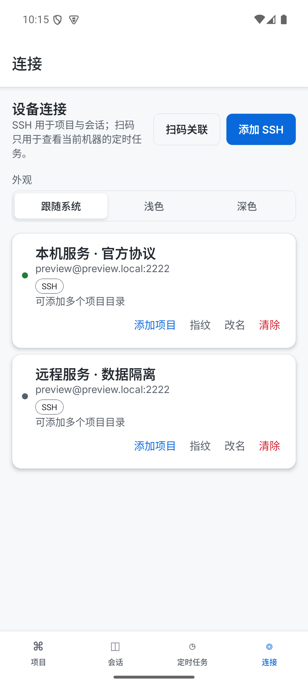
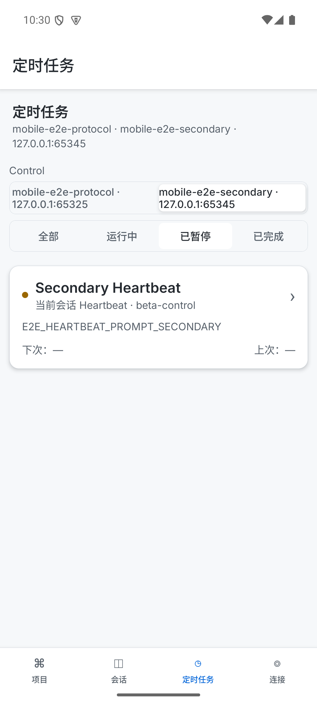
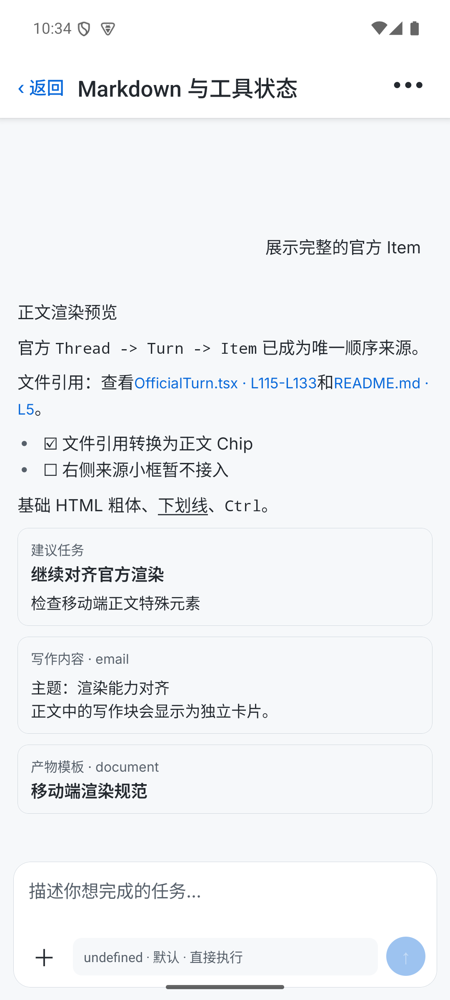

  

<h1 align="center">Tyrs Hand</h1>

Keep Codex in sync across desktop, mobile, and Discord.

Tyrs Hand is a self-hosted Codex solution. Codex runs on your own machine while the service keeps session state available across clients. Start a task in the official desktop app, continue it from your phone or Discord, and use the desktop browser whenever the host machine is online.

## What you can do

- Connect the official Codex Desktop experience, including threads, turns, tools, and interactive questions.
- Use a mobile client inspired by the official app for projects, history, attachments, and conversations.
- Connect directly to a development machine or server over SSH from mobile.
- Follow progress, receive results, and continue conversations from Discord.
- Let tasks use the desktop browser's existing login state and workspace.
- Manage devices, SSH fingerprints, project directories, scheduled tasks, and run history.

## Mobile preview

The screenshots below were captured from the Android emulator.

<table>
  <tr>
    <td align="center"></td>
    <td align="center"></td>
    <td align="center"></td>
  </tr>
  <tr>
    <td align="center">Devices</td>
    <td align="center">Scheduled tasks</td>
    <td align="center">Complex conversation</td>
  </tr>
</table>

## Getting started

See the [minimal installation guide](docs/deployment/minimal-installation.md). In short:

1. Prepare a Control service and a host machine that runs Codex.
2. Install the Worker on the host and complete device enrollment.
3. Connect the mobile client and Discord from the admin console.
4. Pick a project in the official desktop app or mobile client and start a session.

The desktop browser is available while its host machine is online. Mobile SSH keys remain in local secure storage.

## Project status

The project is under active development, with current focus on cross-client session sync, desktop browser access, mobile SSH, device management, and scheduled tasks.

## License

[MIT](LICENSE)
