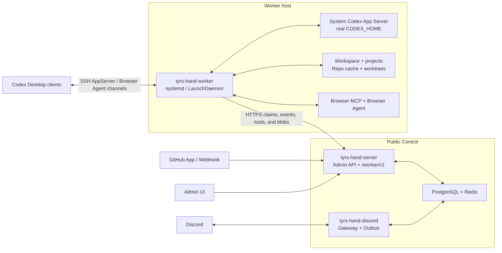

<p align="center">
  
</p>

<h1 align="center">Tyrs Hand</h1>

<p align="center"><a href="README.md">简体中文</a></p>

[](https://github.com/slovx2/tyrs-hand/actions/workflows/ci.yml)
[](https://github.com/slovx2/tyrs-hand/actions/workflows/security.yml)
[](LICENSE)

Tyrs Hand is a self-hosted agent collaboration platform connecting GitHub, Discord, Codex Desktop, and your own machines. A public Control stores events, permissions, and durable state. A host Worker executes tasks with the machine user's real Codex Home, projects, and browser capabilities.

The project is at an early stage and is best evaluated on controlled repositories. The default GitHub Agent may write to worktrees and access the network; review tool allowlists, trigger rules, and permission policies before production use.

## Architecture


```mermaid
flowchart LR
    GitHub["GitHub App / Webhook"] --> Control
    Admin["Admin UI"] --> Control
    Discord["Discord"] <--> Gateway
    subgraph Public["Public Control"]
        Control["tyrs-hand-server\nAdmin API + /worker/v1"]
        Gateway["tyrs-hand-discord\nGateway + Outbox"]
        State["PostgreSQL + Redis"]
        Control <--> State
        Gateway <--> State
    end
    subgraph Host["Worker host"]
        Worker["tyrs-hand-worker\nsystemd / LaunchDaemon"]
        Codex["System Codex App Server\nreal CODEX_HOME"]
        Workspace["Workspace + projects\nRepo cache + worktrees"]
        Browser["Browser MCP + Browser Agent"]
        Worker <--> Codex
        Worker <--> Workspace
        Worker <--> Browser
    end
    Desktop["Codex Desktop clients"] <-->|"SSH AppServer / Browser Agent channels"| Worker
    Worker -->|"HTTPS claims, events, tools, and blobs"| Control
```

Main processes:

- `tyrs-hand-server`: admin API, GitHub App, webhooks, Worker API, and web assets.
- `tyrs-hand-discord`: Discord Gateway, forums, projections, and Outbox delivery.
- `tyrs-hand-worker`: host service for Codex, Git/SSH, browser tools, and multi-client Desktop access.
- `tyrs-hand-admin`: migrations, administrator recovery, master-key rotation, and GC.

PostgreSQL is the only authoritative state store. Redis contains rebuildable rate-limit and notification state. Workers do not connect to either database directly.

## Worker and Workspace

A Worker belongs to one real OS user and may bind to at most one Workspace. A Workspace is a logical resource containing auto-discovered projects and Discord forums; it does not hold runtime configuration.

- `HOME`, `CODEX_HOME`, authentication, provider, base URL, proxy, and model catalog come from the machine user.
- The project root is `~/tyrs-hand/workspaces`; each direct child is a project.
- GitHub work items use a host repo cache and an isolated worktree.
- The built-in SSH server supports multiple keys and clients, PTY, SCP, and SFTP, and connects Codex Desktop clients to one AppServer Hub.
- A Worker starts exactly one Codex App Server for its lifetime. Desktop connections are Hub sessions, so disconnecting one client never restarts or stops the upstream. Restart the Worker to apply machine Codex configuration changes.
- Control assigns outbound SSH credentials and hosts to Workers. GitHub tokens never enter the Codex environment or Git remotes.

The minimum Codex CLI version is `0.145.0`. Worker startup and `doctor` reject older versions.

## Codex configuration boundary

Control does not store or distribute provider settings, API keys, ChatGPT authentication, base URLs, proxies, `config.toml`, or `auth.json`.

“GitHub Agent settings” apply only to `github_work_item` tasks:

- Agent Profiles and repository overrides may set model, reasoning, service tier, sandbox, and tool parameters.
- Global GitHub Agent instructions are injected as developer instructions for that GitHub turn and are never written to the machine home.

Desktop, Discord, and Mobile do not consume these defaults. Explicit session or turn choices still apply; unspecified values are resolved by the machine Codex Home. Initial titles use fallback text, followed by native Codex `thread/name/updated` events.

## Browser

- Worker tasks call the host Browser MCP and controlled host file directory directly.
- The browser token is read only from a restricted file owned by the Worker user and never enters Control or task snapshots.
- Codex Desktop reaches the host browser over the Worker's Browser Agent SSH channel.
- Worker browser tasks and multiple Desktop clients run concurrently; disconnecting one Desktop client does not interrupt the others.

## Quick start

See the [minimal installation guide](docs/deployment/minimal-installation.md) for complete production steps.

Control requires Docker Engine, Docker Compose, PostgreSQL, Redis, and an HTTPS endpoint. Source development additionally requires Go `1.26.5`, Node.js `24.14.0`, pnpm `11.14.0`, and Codex `>= 0.145.0`.

```bash
cp .env.example .env
install -d -m 0700 .local/secrets
openssl rand -base64 32 > .local/secrets/master_key
openssl rand -hex 32 > .local/secrets/postgres_password
docker compose -f compose.yaml -f compose.production.yaml up -d postgres redis
docker compose -f compose.yaml -f compose.production.yaml --profile tools run --rm admin migrate
docker compose -f compose.yaml -f compose.production.yaml up -d server discord
```

After creating an administrator, GitHub App, Discord integration, and Worker in the admin UI, install the host Worker with its one-time enrollment token:

```bash
sudo env \
  TYRS_HAND_RELEASE_VERSION=v0.2.0 \
  TYRS_HAND_WORKER_CONTROL_URL=https://agent.example.com \
  TYRS_HAND_WORKER_ENROLLMENT_TOKEN=<one-time-token> \
  TYRS_HAND_WORKER_PUBLIC_KEYS_FILE=/path/to/authorized_keys \
  TYRS_HAND_WORKER_USER=<os-user> \
  sh deploy/worker/install.sh
```

The installer verifies SHA-256 and the Sigstore bundle, runs dependency checks, and installs a Linux systemd unit or macOS LaunchDaemon. Exact dependency declarations live in `deploy/worker/dependencies.json`.

## Worker API

Workers use a Bearer credential with a direct, single-version REST API:

```text
POST /worker/v1/enroll
POST /worker/v1/heartbeat
POST /worker/v1/claims
GET  /worker/v1/workspace
POST /worker/v1/workspace/projects/snapshot
GET|POST /worker/v1/blobs/{id}
... direct Desktop, Thread, Turn, Run, Tool, Git, and SSH endpoints
```

The protocol has no envelope, RPC route mapper, or version-forwarding layer. See `api/openapi.yaml` for the complete contract.

## Admin UI

The admin UI has six groups:

1. Overview: Control, Worker, Codex, Browser, GitHub, and Discord health.
2. Workers: enrollment, capacity, dependencies, and embedded Workspace/project/forum management.
3. Clients: device pairing, status, and revocation.
4. Integrations: GitHub, repositories, rules, Discord, and GitHub Agent settings.
5. Access: outbound SSH credentials, hosts, and Worker assignments.
6. Operations: work items, threads, jobs, caches, and audit data.

## Security

- Administrator passwords use Argon2id; secrets use AES-256-GCM.
- Sessions use opaque cookies with HttpOnly, SameSite, and CSRF protections.
- Webhooks are body-limited, HMAC-SHA256 verified, and deduplicated by delivery ID.
- Run results validate capabilities, lease tokens, and monotonic epochs.
- Dynamic tools validate installation, repository, work item, allowlists, and live GitHub permissions.
- Worker API access supports IP/CIDR allowlists and trusts forwarded addresses only from configured proxies.
- The built-in SSH server accepts session channels only and does not expose port forwarding.

Never commit `.env`, `.local/`, Codex Home data, private keys, worktrees, or repo caches.

## Development and release

```bash
pnpm --dir web install --frozen-lockfile
make generate
make ci-local
```

Integration tests start PostgreSQL and Redis with Testcontainers and validate the App Server with a real supported Codex version against a mock Responses upstream. Browser acceptance must reconcile tool output, host bridge state, file exchange, task records, projections, and Outbox state.

GitHub Actions publishes a provenance/SBOM/keyless-Cosign-signed Control image plus Linux/macOS amd64/arm64 Worker tarballs, SHA-256 files, and Sigstore bundles. Production must pin a Control digest and exact Worker version; do not use `latest`.

## License

[MIT](LICENSE)
