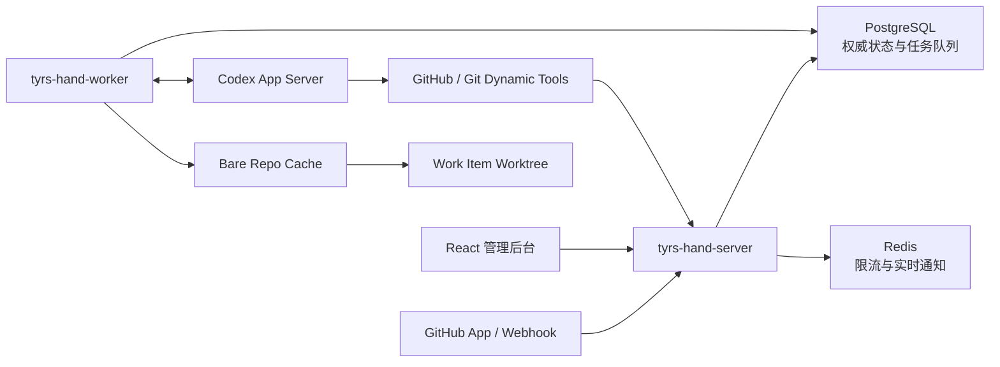

<p align="center">
  
</p>

<h1 align="center">Tyrs Hand</h1>

<p align="center"><a href="README.en.md">English</a></p>

[](https://github.com/slovx2/tyrs-hand/actions/workflows/ci.yml)
[](https://github.com/slovx2/tyrs-hand/actions/workflows/security.yml)
[](LICENSE)

Tyrs Hand 是一个面向 GitHub 的自托管 Agent 控制系统。它以 GitHub App 接收 Issue、Pull Request 和评论事件，在隔离的 Git Worktree 中运行 Codex，并为同一个工作项持续复用上下文。

项目目前处于早期版本，适合在受控仓库中评估和二次开发。默认 Agent 配置允许访问公网并写入 Worktree；接入生产仓库前，请先审查工具白名单、触发规则和权限策略。

## 能做什么

- 通过 GitHub App 接收并验签 Webhook，不需要普通机器账号。
- 将 GitHub 事件标准化为持久化 Work Item 和 Durable Job。
- 每个仓库维护 Bare Clone Cache，每个 Work Item 维护长期 Worktree。
- 同一 Issue 或 PR 串行处理，不同工作项可以由多个 Worker 并行处理。
- 同一工作项后续评论复用 Codex Thread；配置变化时使用持久化摘要交接。
- 从仓库 `.agents/skills/<name>/SKILL.md` 加载任务 Skill。
- 将 GitHub 官方 MCP 工具和受控本地 Git 工具暴露为 Codex Dynamic Tools。
- 管理 GitHub App、仓库、规则、Agent Profile、任务、Thread、Worker 和审计日志。
- 以结构化结果区分 `succeeded`、`blocked` 和协议或执行失败。

## 架构



三个可执行入口分别承担不同职责：

- `tyrs-hand-server`：管理 API、GitHub App、Webhook 和前端静态资源。
- `tyrs-hand-worker`：任务租约、Git Workspace、Codex 进程池和工具调用。
- `tyrs-hand-admin`：迁移、诊断、管理员恢复、主密钥轮换和 GC。

PostgreSQL 是唯一权威状态源。Redis 仅保存可以重建的限流和通知状态。

## 快速开始

### 环境要求

- Docker Engine 与 Docker Compose
- 本地源码开发额外需要 Go `1.26.5`、Node.js `24.14.0` 和 pnpm `11.14.0`
- Codex CLI/App Server 固定为 `0.142.5`，容器镜像已经包含该版本

### 启动服务

1. 创建本地配置和 Secret：

   ```bash
   cp .env.example .env
   install -d -m 0700 .local/secrets
   printf '%s' 'tyrs_hand' > .local/secrets/postgres_password
   openssl rand -base64 32
   openssl rand -hex 32
   ```

   将两个随机值分别写入 `.env` 的 `TYRS_HAND_MASTER_KEY` 和 `TYRS_HAND_SETUP_TOKEN`。本地默认 PostgreSQL 密码为 `tyrs_hand`；生产环境必须同时替换 `.env` 中的 `POSTGRES_PASSWORD` 和 Secret 文件内容。

2. 构建镜像并执行显式迁移：

   ```bash
   docker compose build server
   docker compose up -d postgres redis
   docker compose --profile tools run --rm admin migrate
   docker compose up -d server worker
   ```

   Server 和 Worker 启动时只检查迁移状态，不会自行修改数据库结构。

3. 打开 `http://localhost:8080/setup`，使用 Setup Token 创建管理员，并立即保存 TOTP Secret 和一次性恢复码。

4. 在 GitHub App 页面通过 Manifest 创建 App，或者手动录入已有 App。安装 App 后，Installation 与 Repository 会通过已验签 Webhook 自动同步。

5. 在系统设置中配置 OpenAI 兼容 Base URL、API Key、模型和推理级别。也可以使用共享账号登录：

   ```bash
   docker compose --profile tools run --rm admin codex-login
   ```

## Webhook 监听分离

默认情况下，管理端、内部 API 与 Webhook 共用 `TYRS_HAND_HTTP_ADDR`，只启动一个 HTTP 端口。

需要在网络层隔离 Webhook 时，可以配置：

```dotenv
TYRS_HAND_SEPARATE_WEBHOOK=true
TYRS_HAND_WEBHOOK_HTTP_ADDR=:8081
```

开启后，管理端口不再注册 `/webhooks/github`，Webhook 端口只注册健康检查和 GitHub Webhook。部署系统还需要单独发布该端口，并由反向代理将 `/webhooks/github` 路由到它。

## GitHub App 权限

默认 Manifest 请求以下最小权限：

| 权限 | 级别 |
| --- | --- |
| Metadata | Read |
| Contents | Read & Write |
| Issues | Read & Write |
| Pull Requests | Read & Write |
| Actions | Read |
| Checks | Read |

Manifest 订阅 Repository、Issues、Issue Comment、Pull Request、Review、Review Comment 和 Push。Installation 生命周期事件由 GitHub 自动发送给 App。

默认规则处理 Issue 和 Pull Request 评论中的 Bot `@mention`。GitHub 不允许普通 App Bot 被直接选为 Reviewer；如需在仓库发生 Reviewer 请求时触发 Agent，管理员可以显式添加 `pull_request.review_requested` 规则。

## Thread、Skill 与工作区

- 一个 `(Work Item, Agent Profile, Context Version)` 对应一个 Codex Thread。
- 同一 Issue 或 PR 的后续指令 Resume 原 Thread。
- Provider、Profile、工具 Schema 或 Skill 配置变化时创建新 Thread，并注入上一轮摘要。
- 一个 Work Item 对应一个长期 Worktree；同一工作项严格串行。
- Issue 创建的 PR 会自动关联回原 Work Item。
- 失败任务保留现场，租约或 Head 不一致时隔离旧 Worktree 并重建。

仓库任务 Skill 必须位于：

```text
.agents/skills/<skill-name>/SKILL.md
```

规则中声明的 Skill 不存在或未被 Codex `skills/list` 发现时，任务会以配置错误结束，不会让模型猜测。

## 安全模型

- 管理员密码使用 Argon2id，Secret 使用 AES-256-GCM 加密。
- Session 使用随机不透明 Cookie，并启用 HttpOnly、SameSite 和 CSRF 防护。
- Webhook 在限制 Body 大小后执行 HMAC-SHA256 常量时间验签，并按 Delivery ID 去重。
- Job 结果必须匹配当前 lease token 和单调递增 epoch。
- Dynamic Tool 同时校验 Capability、Installation、Repository、Work Item、工具白名单和实时 GitHub 权限。
- Tool Call 以 `(thread, turn, call)` 幂等记录。
- GitHub Token 不进入 Codex 环境、Git Remote 或 Worktree。
- Server 与 Worker 容器均以非 root 用户运行。

生产环境应使用 `compose.production.yaml`，通过 Secret 文件提供主密钥：

```bash
docker compose -f compose.yaml -f compose.production.yaml up -d
```

不要提交 `.env`、`.local/`、CODEX_HOME、私钥、Worktree 或仓库缓存。

## 开发与测试

```bash
pnpm --dir web install --frozen-lockfile
make generate
make format-check
make lint
make test
make test-race
make test-integration
make test-coverage
make build
```

集成测试使用 Testcontainers 启动 PostgreSQL 和 Redis，并使用临时 Git Remote 验证 Worktree。Codex 测试包含两层：

- 脚本化 Fake App Server，覆盖 JSON-RPC、超时、断线、Resume、Steer、Interrupt 和工具回调。
- 固定 Codex `0.142.5` 配合 Mock Responses SSE 上游，验证真实 App Server 协议，不调用真实模型。

前端测试使用 Vitest、Testing Library、MSW 和 Playwright。OpenAPI 3.1 同时生成 Go Gin 接口与前端 TypeScript 类型。

## 镜像与发布

GitHub Actions 对 Pull Request 构建但不推送镜像。`main` 和 `v*` Tag 会构建 `linux/amd64`、`linux/arm64` 多架构镜像并推送到：

```text
ghcr.io/slovx2/tyrs-hand
```

每次推送都会生成不可变的 `sha-<commit>` Tag；`main` 额外更新 `main` Tag，版本 Tag 额外发布同名镜像。发布构建包含 SBOM、provenance，版本镜像执行漏洞扫描和 Cosign keyless 签名。

生产部署应固定 `sha-<commit>` Tag 或镜像 Digest，不使用 `latest`。

## 贡献

提交改动前请运行与变更范围匹配的测试，并确保生成代码没有漂移。Bug 报告应包含事件类型、期望行为和脱敏后的日志；不要在 Issue 中粘贴 Token、Webhook Secret、Private Key 或完整 Agent Event。

## License

[MIT](LICENSE)
