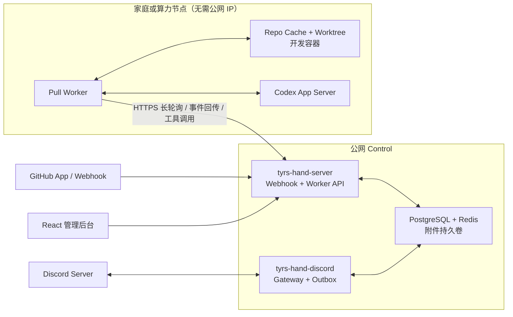

<p align="center">
  
</p>

<h1 align="center">Tyrs Hand</h1>

<p align="center"><a href="README.en.md">English</a></p>

[](https://github.com/slovx2/tyrs-hand/actions/workflows/ci.yml)
[](https://github.com/slovx2/tyrs-hand/actions/workflows/security.yml)
[](LICENSE)

Tyrs Hand 是一个面向 GitHub 与 Discord 的自托管 Agent 控制系统。GitHub 任务在隔离的临时 Git Worktree 中执行轻量修改；Discord 开发 Forum 则使用用户级长期开发容器，并持久化仓库 clone、Home 和 Codex 会话。

项目目前处于早期版本，适合在受控仓库中评估和二次开发。默认 Agent 配置允许访问公网并写入 Worktree；接入生产仓库前，请先审查工具白名单、触发规则和权限策略。

## 亮点功能：把闲置家庭电脑变成执行节点

Tyrs Hand 支持把公网 Control 与实际运行 Codex 的 Worker 分开部署。公网小服务器负责稳定接收 GitHub Webhook、连接 Discord 和调用外部 API；家里的高性能电脑只需通过 HTTPS 主动领取任务，就能贡献 CPU、内存、磁盘和 Docker 能力。家庭网络不需要公网 IP、端口转发或 SSH 反向隧道，Cloudflare 也只是可选代理。首版可以让所有新建资源使用一个默认家庭节点，之后再扩展更多节点和分配策略。

## 能做什么

- 通过 GitHub App 接收并验签 Webhook，不需要普通机器账号。
- 将 GitHub 事件标准化为持久化 Work Item 和 Durable Job。
- 每个仓库维护 Bare Clone Cache，每个 GitHub Work Item 使用独立临时 Worktree；关闭 7 天后自动清理。
- 同一 Issue 或 PR 串行处理，不同工作项可以由多个 Worker 并行处理。
- 同一工作项后续评论复用 Codex Thread；配置变化时使用持久化摘要交接。
- 从仓库 `.agents/skills/<name>/SKILL.md` 加载任务 Skill。
- 将 GitHub 官方 MCP 工具和受控本地 Git 工具暴露为 Codex Dynamic Tools。
- 通过 Discord 私有 Server 提供长期开发 Forum、GitHub 任务投影和持续会话。
- 同一 Discord 用户复用一个开发容器与 Home；每个 Forum 固定一个仓库并保留独立完整 clone。
- 通过公网 HTTPS Control 与 Pull Worker 分离部署，家庭执行节点不需要公网 IP。
- 管理 GitHub App、仓库、规则、Agent Profile、任务、Thread、执行节点、默认 Placement 和审计日志。
- Codex 使用自然最终回复；平台根据 App Server 终态、持久化 Control 和受控回复门禁判定任务结果。

## 架构



四个可执行入口分别承担不同职责：

- `tyrs-hand-server`：管理 API、GitHub App、Webhook 和前端静态资源。
- `tyrs-hand-worker`：通过 `/worker/v1` 主动领取任务，在执行节点运行工作区、Codex、本地 Git 和开发容器。
- `tyrs-hand-discord`：Discord Gateway、Forum 会话、投影和 Outbox 投递。
- `tyrs-hand-admin`：迁移、诊断、管理员恢复、主密钥轮换和 GC。

PostgreSQL 是唯一权威状态源。Redis 仅保存可以重建的限流和通知状态。Worker 不直连二者，也不持有 Control 主密钥或 Discord Bot Token。

## 快速开始

最小生产安装请参阅[最小安装指引](docs/deployment/minimal-installation.md)。

### 环境要求

- Docker Engine 与 Docker Compose
- 本地源码开发额外需要 Go `1.26.5`、Node.js `24.14.0` 和 pnpm `11.14.0`
- Codex CLI/App Server 固定为 `0.142.5`，容器镜像已经包含该版本

### 启动服务

1. 创建本地配置和 Secret：

   ```bash
   cp .env.example .env
   install -d -m 0700 .local/secrets
   printf '%s' 'tyrs_hand' > .local/secrets/postgres_password
   openssl rand -base64 32
   openssl rand -hex 32
   ```

   将两个随机值分别写入 `.env` 的 `TYRS_HAND_MASTER_KEY` 和 `TYRS_HAND_SETUP_TOKEN`。本地默认 PostgreSQL 密码为 `tyrs_hand`；生产环境必须同时替换 `.env` 中的 `POSTGRES_PASSWORD` 和 Secret 文件内容。

2. 构建 Control 镜像并执行显式迁移：

   ```bash
   docker compose build server
   docker compose up -d postgres redis
   docker compose --profile tools run --rm admin migrate
   docker compose up -d server discord
   ```

   Server 启动时只检查迁移状态，不会自行修改数据库结构。

3. 打开 `http://localhost:8080/setup`，使用 Setup Token 创建管理员，并立即保存 TOTP Secret 和一次性恢复码。

4. 在 GitHub App 页面通过 Manifest 创建 App，或者手动录入已有 App。安装 App 后，Installation 与 Repository 会通过已验签 Webhook 自动同步。

5. 在系统设置中配置 OpenAI 兼容 Base URL、API Key、模型和推理级别。也可以使用共享账号登录：

   ```bash
   docker compose --profile tools run --rm admin codex-login
   ```

6. 完整生产部署还需要在管理后台创建执行节点，并使用独立的 `compose.worker.yaml` 启动 Pull Worker。注册、默认节点和 IP/CIDR 白名单步骤见[最小安装指引](docs/deployment/minimal-installation.md)。

## Webhook 监听分离

默认情况下，管理端、内部 API 与 Webhook 共用 `TYRS_HAND_HTTP_ADDR`，只启动一个 HTTP 端口。

需要在网络层隔离 Webhook 时，可以配置：

```dotenv
TYRS_HAND_SEPARATE_WEBHOOK=true
TYRS_HAND_WEBHOOK_HTTP_ADDR=:8081
```

开启后，管理端口不再注册 `/webhooks/github`，Webhook 端口只注册健康检查和 GitHub Webhook。部署系统还需要单独发布该端口，并由反向代理将 `/webhooks/github` 路由到它。

## Discord 长期开发容器

Discord 开发环境由带 `discord` 角色的执行节点管理。第一版可让同一个默认节点同时承担 GitHub 和 Discord 任务；系统不会强制建立“Discord 用户—节点”绑定。开发环境创建时会冻结当时的默认节点，后续 Forum、Conversation 和 Codex Control 都沿用该节点。

只有启用 Discord 开发容器的 Worker 挂载宿主 Docker Socket，Socket 不会进入 Agent 所在的开发容器。部署前将 Worker 宿主 `/var/run/docker.sock` 的数字 GID 写入 Worker `.env` 的 `TYRS_HAND_DOCKER_GID`。Linux 可使用 `stat -c '%g' /var/run/docker.sock` 查询，然后使用独立 Compose 启动：

```bash
docker compose -f compose.worker.yaml up -d worker
```

开发环境规则：

- 同一 Guild 中，一个 Discord 用户只有一个容器、数据卷、Home 卷和网络；多个仓库 Forum 复用它们。
- 用户级容器是安全边界；可操作协作者能够驱动 Agent，因此只能授权给该环境 owner 信任的成员。
- 首个 Forum 的仓库成为稳定的镜像构建来源，必须在默认分支提供 `.devcontainer/Dockerfile`，且最终镜像声明非 root `USER`。
- 每个 Forum 使用独立完整 clone。环境容器永久运行；Worker/宿主重启后会主动拉起容器、环境级 Codex app-server 和 Relay，且不会丢失 Home、clone 或 Codex 会话。
- 每个环境共享一个 `CODEX_HOME` 和一个 app-server；Desktop 与 Discord 通过薄 Relay 复用同一协议连接。显式 rebuild 保留 Home、clone 和 Codex 会话，但重置系统可写层。
- 管理后台可为环境配置一个 SSH 公钥和宿主机端口。镜像必须原生提供 `sshd`、`ssh-keygen` 与 SFTP server；Desktop 通过 SSH 执行 `codex app-server proxy`。
- rebuild 改变 `USER`、UID/GID 或 Home 路径时会被拒绝并保留旧容器。平台不支持 devcontainer.json、Features、Compose、任意 Mount、Docker Socket、privileged 或端口发布。
- 删除 Forum 前会显示未提交、未推送和运行中状态；删除最后一个 Forum 会同时删除整个用户环境和 Home。

## GitHub App 权限

默认 Manifest 请求以下最小权限：

| 权限 | 级别 |
| --- | --- |
| Metadata | Read |
| Contents | Read & Write |
| Issues | Read & Write |
| Pull Requests | Read & Write |
| Actions | Read |
| Checks | Read |

Manifest 订阅 Repository、Issues、Issue Comment、Pull Request、Review、Review Comment 和 Push。Installation 生命周期事件由 GitHub 自动发送给 App。

默认规则接受 Issue 和 Pull Request 评论第一行的 `/tyrs-hand` 命令、第一行任意位置可见且精确匹配 App 登录名的 `@mention`，以及名称为 `tyrs-hand` 的结构化 Label 事件。Mention 匹配大小写不敏感，并忽略后续行、引用、代码、转义、URL 和用户名后缀。旧版全文 `@mention` 仅作为默认关闭的兼容规则；GitHub 不允许普通 App Bot 被直接选为 Reviewer，如需在 Reviewer 请求时触发 Agent，管理员可以显式添加 `pull_request.review_requested` 事件规则。

## Thread、Skill 与工作区

- 一个 `(Work Item, Agent Profile, Context Version)` 对应一个 Codex Thread。
- 同一 Issue 或 PR 的后续指令 Resume 原 Thread。
- Provider、Profile、工具 Schema 或 Skill 配置变化时创建新 Thread，并注入上一轮摘要。
- 一个 GitHub Work Item 对应一个临时 Worktree；同一工作项严格串行，关闭 7 天后清理。
- GitHub 路径不安装依赖、不共享依赖，也不准备工具链；定位是只读或轻量修改，不建议在 Worker 本地构建、运行和调试。
- Issue/PR 地址与编号会注入 Prompt；PR 还会预拉源分支并注入源/目标分支与 SHA。
- Issue 创建的 PR 会自动关联回原 Work Item。
- 失败任务保留现场，租约或 Head 不一致时隔离旧 Worktree 并重建。

仓库任务 Skill 必须位于：

```text
.agents/skills/<skill-name>/SKILL.md
```

规则中声明的 Skill 不存在或未被 Codex `skills/list` 发现时，任务会以配置错误结束，不会让模型猜测。

## 安全模型

- 管理员密码使用 Argon2id，Secret 使用 AES-256-GCM 加密。
- Session 使用随机不透明 Cookie，并启用 HttpOnly、SameSite 和 CSRF 防护。
- Webhook 在限制 Body 大小后执行 HMAC-SHA256 常量时间验签，并按 Delivery ID 去重。
- Job 结果必须匹配当前 lease token 和单调递增 epoch。
- Dynamic Tool 同时校验 Capability、Installation、Repository、Work Item、工具白名单和实时 GitHub 权限。
- Tool Call 以 `(thread, turn, call)` 幂等记录。
- GitHub Token 不进入 Codex 环境、Git Remote 或 Worktree。
- Server、Worker 与 Discord 开发镜像均要求以非 root 用户运行。
- Worker 只通过 HTTPS Worker API 访问 Control，不直连 PostgreSQL 或 Redis，也不在长期配置或进程环境中持有主密钥、Discord Bot Token 或 Provider Key；运行所需凭据由 Control 按 Run 限定下发。
- Worker API 支持单个 IP 和 CIDR 白名单；直连不依赖 Cloudflare，只有可信代理链才采信转发来源头。
- 只有启用 Discord 开发容器的 Worker 可以访问宿主 Docker Socket，开发容器自身不可访问。

生产 Control 应使用 `compose.production.yaml`，通过 Secret 文件提供主密钥；Worker 使用独立的 `compose.worker.yaml`：

```bash
docker compose -f compose.yaml -f compose.production.yaml up -d
```

不要提交 `.env`、`.local/`、CODEX_HOME、私钥、Worktree 或仓库缓存。

## 开发与测试

```bash
pnpm --dir web install --frozen-lockfile
make generate
make format-check
make lint
make test
make test-race
make test-integration
make test-coverage
make build
```

集成测试使用 Testcontainers 启动 PostgreSQL、Redis 和真实 Docker 开发容器，并使用临时 Git Remote 验证 Worktree、多仓库 clone、Home/重建持久化与删除。Codex 测试包含两层：

- 脚本化 Fake App Server，覆盖 JSON-RPC、超时、断线、Resume、Steer、Interrupt 和工具回调。
- 固定 Codex `0.142.5` 配合 Mock Responses SSE 上游，验证真实 App Server 协议，不调用真实模型。

前端测试使用 Vitest、Testing Library、MSW 和 Playwright。OpenAPI 3.1 同时生成 Go Gin 接口与前端 TypeScript 类型。

## 镜像与发布

GitHub Actions 对 Pull Request 和 `main` 构建 Control、Worker 镜像但不推送。发布 Release 时会构建 `linux/amd64`、`linux/arm64` 多架构镜像：

```text
ghcr.io/slovx2/tyrs-hand-control
ghcr.io/slovx2/tyrs-hand-worker
```

发布构建包含 SBOM 和 provenance，并使用 `sha-<commit>` 候选 Tag 执行漏洞扫描和 Cosign keyless 签名。两个候选镜像全部通过后，才会为 Control 和 Worker 创建 Release 版本 Tag。

生产部署应固定 `sha-<commit>` Tag 或镜像 Digest，不使用 `latest`。

## 贡献

提交改动前请运行与变更范围匹配的测试，并确保生成代码没有漂移。Bug 报告应包含事件类型、期望行为和脱敏后的日志；不要在 Issue 中粘贴 Token、Webhook Secret、Private Key 或完整 Agent Event。

## License

[MIT](LICENSE)
