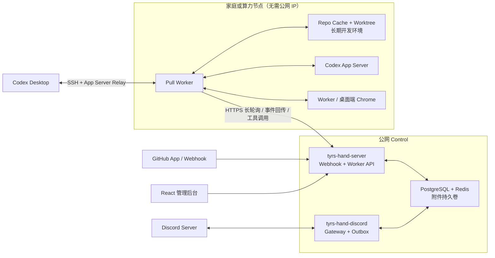

<p align="center">
  
</p>

<h1 align="center">Tyrs Hand</h1>

<p align="center"><a href="README.en.md">English</a></p>

[](https://github.com/slovx2/tyrs-hand/actions/workflows/ci.yml)
[](https://github.com/slovx2/tyrs-hand/actions/workflows/security.yml)
[](LICENSE)

Tyrs Hand 是一个把 GitHub、Discord、Codex Desktop 和自有算力连接在一起的自托管 Agent 协作平台。公网 Control 负责事件、状态和权限，Pull Worker 在你自己的电脑上运行 Codex、工作区、开发容器和浏览器工具。

项目目前处于早期版本，适合在受控仓库中评估和二次开发。默认 Agent 配置允许访问公网并写入 Worktree；接入生产仓库前，请先审查工具白名单、触发规则和权限策略。

## 核心特色

### 分布式部署，让闲置电脑成为执行节点

把控制服务和真正执行任务的电脑分开部署。家里、办公室或机房里的闲置电脑都可以加入，提供更多算力和存储空间；不需要公网 IP，也不用折腾端口转发。需要更多能力时，继续添加电脑即可。

### Codex Desktop 直连，并使用桌面端浏览器

可以直接从 Codex Desktop 打开和继续 Tyrs Hand 中的项目与会话。Agent 还能使用你桌面端 Chrome 中已经登录的网站和已打开的普通页面，减少重复登录和来回切换。

### Discord 双向同步与多人协作

Codex Desktop 与 Discord 会同步消息、进度和结果，可以在任意一端继续对话。项目可以邀请只读或可操作的协作者，让多人围绕同一个项目、同一段 Agent 会话一起讨论和推进工作。

## 更多能力

- 通过 GitHub App 接收并验签 Webhook，不需要普通机器账号。
- 将 GitHub 事件标准化为持久化 Work Item 和 Durable Job。
- 每个仓库维护 Bare Clone Cache，每个 GitHub Work Item 使用独立临时 Worktree；关闭 7 天后自动清理。
- 同一 Issue 或 PR 串行处理，不同工作项可以由多个 Worker 并行处理。
- 同一工作项后续评论复用 Codex Thread；配置变化时使用持久化摘要交接。
- 从仓库 `.agents/skills/<name>/SKILL.md` 加载任务 Skill。
- 将 GitHub 官方 MCP 工具和受控本地 Git 工具暴露为 Codex Dynamic Tools。
- 通过 Discord 私有 Server 提供长期开发 Forum、GitHub 任务投影和持续会话。
- 同一 Discord 用户复用一个开发容器与 Home；环境自动发现 Git 仓库和普通目录项目，并可将项目绑定到多个 Forum。
- 通过公网 HTTPS Control 与 Pull Worker 分离部署，家庭执行节点不需要公网 IP。
- 管理 GitHub App、仓库、规则、Agent Profile、任务、Thread、长期开发环境、执行节点、SSH、默认 Placement 和审计日志。
- Codex 使用自然最终回复；平台根据 App Server 终态、持久化 Control 和受控回复门禁判定任务结果。

## 架构


```mermaid
flowchart LR
    subgraph Public["公网 Control"]
        Server["tyrs-hand-server\nWebhook + Worker API"]
        Gateway["tyrs-hand-discord\nGateway + Outbox"]
        State["PostgreSQL + Redis\n附件持久卷"]
        Server <--> State
        Gateway <--> State
    end
    GitHub["GitHub App / Webhook"] --> Server
    Admin["React 管理后台"] --> Server
    Discord["Discord Server"] <--> Gateway
    subgraph Home["家庭或算力节点（无需公网 IP）"]
        Worker["Pull Worker"]
        Workspace["Repo Cache + Worktree\n长期开发环境"]
        Codex["Codex App Server"]
        Browser["Worker / 桌面端 Chrome"]
        Worker <--> Workspace
        Worker <--> Codex
        Worker <--> Browser
    end
    Desktop["Codex Desktop"] <-->|"SSH + App Server Relay"| Worker
    Worker -->|"HTTPS 长轮询 / 事件回传 / 工具调用"| Server
```

四个可执行入口分别承担不同职责：

- `tyrs-hand-server`：管理 API、GitHub App、Webhook 和前端静态资源。
- `tyrs-hand-worker`：宿主常驻 Worker，通过 `/worker/v2` 主动领取任务，并内置多客户端 SSH 与 App Server Hub。
- `tyrs-hand-discord`：Discord Gateway、Forum 会话、投影和 Outbox 投递。
- `tyrs-hand-admin`：迁移、诊断、管理员恢复、主密钥轮换和 GC。

PostgreSQL 是唯一权威状态源。Redis 仅保存可以重建的限流和通知状态。Worker 不直连二者，也不持有 Control 主密钥或 Discord Bot Token。

## 快速开始

最小生产安装请参阅[最小安装指引](docs/deployment/minimal-installation.md)。

### 环境要求

- Docker Engine 与 Docker Compose
- 本地源码开发额外需要 Go `1.26.5`、Node.js `24.14.0` 和 pnpm `11.14.0`
- Worker 宿主需安装 Codex CLI/App Server `>= 0.145.0`、Git 和 OpenSSH Client

### 启动服务

1. 创建本地配置和 Secret：

   ```bash
   cp .env.example .env
   install -d -m 0700 .local/secrets
   printf '%s' 'tyrs_hand' > .local/secrets/postgres_password
   openssl rand -base64 32
   openssl rand -hex 32
   ```

   将两个随机值分别写入 `.env` 的 `TYRS_HAND_MASTER_KEY` 和 `TYRS_HAND_SETUP_TOKEN`。本地默认 PostgreSQL 密码为 `tyrs_hand`；生产环境必须同时替换 `.env` 中的 `POSTGRES_PASSWORD` 和 Secret 文件内容。

2. 构建 Control 镜像并执行显式迁移：

   ```bash
   docker compose build server
   docker compose up -d postgres redis
   docker compose --profile tools run --rm admin migrate
   docker compose up -d server discord
   ```

   Server 启动时只检查迁移状态，不会自行修改数据库结构。

3. 打开 `http://localhost:8080/setup`，使用 Setup Token 创建管理员，并立即保存 TOTP Secret 和一次性恢复码。

4. 在 GitHub App 页面通过 Manifest 创建 App，或者手动录入已有 App。安装 App 后，Installation 与 Repository 会通过已验签 Webhook 自动同步。

5. 在管理后台创建 Worker、选择角色和并发上限，并生成一次性注册 Token。

6. 从 GitHub Release 安装宿主 Worker。Codex Provider 和登录态只读取该宿主用户的真实 `CODEX_HOME`，Control 不配置也不下发。

## Webhook 监听分离

默认情况下，管理端、内部 API 与 Webhook 共用 `TYRS_HAND_HTTP_ADDR`，只启动一个 HTTP 端口。

需要在网络层隔离 Webhook 时，可以配置：

```dotenv
TYRS_HAND_SEPARATE_WEBHOOK=true
TYRS_HAND_WEBHOOK_HTTP_ADDR=:8081
```

开启后，管理端口不再注册 `/webhooks/github`，Webhook 端口只注册健康检查和 GitHub Webhook。部署系统还需要单独发布该端口，并由反向代理将 `/webhooks/github` 路由到它。

## 宿主 Worker

Worker 与 Relay 已合并。一个 Worker 绑定一个真实 OS 用户，直接使用该用户的 `HOME`、`CODEX_HOME` 和 `~/tyrs-hand/workspaces`，不创建开发容器，也不迁移或改写已有 Codex 聊天记录。

- Worker 只启动一个系统 Codex App Server，所有 GitHub、Discord、移动端和 Desktop 客户端共享该 Hub。
- 内置 SSH Server 支持多公钥、多客户端、Shell、PTY、SCP 和 SFTP；拦截 `codex app-server proxy`，并禁止所有端口转发。
- Codex Provider、API Key、ChatGPT Auth、Base URL 和代理只由机器 `CODEX_HOME` 决定。
- Control 仍可下发任务的模型、思考强度、Service Tier 和 Agent 指令，但不会写入机器 Home。
- Browser Bridge、GitHub、Discord、移动客户端和 Agent 出站 SSH 能力保留。
- 四平台薄二进制、依赖声明和 systemd/LaunchDaemon 安装方法见[最小安装指引](docs/deployment/minimal-installation.md)。

## GitHub App 权限

默认 Manifest 请求以下最小权限：

| 权限 | 级别 |
| --- | --- |
| Metadata | Read |
| Contents | Read & Write |
| Issues | Read & Write |
| Pull Requests | Read & Write |
| Actions | Read |
| Checks | Read |

Manifest 订阅 Repository、Issues、Issue Comment、Pull Request、Review、Review Comment 和 Push。Installation 生命周期事件由 GitHub 自动发送给 App。

默认规则接受 Issue 和 Pull Request 评论第一行的 `/tyrs-hand` 命令、第一行任意位置可见且精确匹配 App 登录名的 `@mention`，以及名称为 `tyrs-hand` 的结构化 Label 事件。Mention 匹配大小写不敏感，并忽略后续行、引用、代码、转义、URL 和用户名后缀。旧版全文 `@mention` 仅作为默认关闭的兼容规则；GitHub 不允许普通 App Bot 被直接选为 Reviewer，如需在 Reviewer 请求时触发 Agent，管理员可以显式添加 `pull_request.review_requested` 事件规则。

## Thread、Skill 与工作区

- 一个 `(Work Item, Agent Profile, Context Version)` 对应一个 Codex Thread。
- 同一 Issue 或 PR 的后续指令 Resume 原 Thread。
- Model、Profile、工具 Schema 或 Skill 配置变化时创建新 Thread，并注入上一轮摘要。
- 一个 GitHub Work Item 对应一个临时 Worktree；同一工作项严格串行，关闭 7 天后清理。
- GitHub 路径不安装依赖、不共享依赖，也不准备工具链；定位是只读或轻量修改，不建议在 Worker 本地构建、运行和调试。
- Issue/PR 地址与编号会注入 Prompt；PR 还会预拉源分支并注入源/目标分支与 SHA。
- Issue 创建的 PR 会自动关联回原 Work Item。
- 失败任务保留现场，租约或 Head 不一致时隔离旧 Worktree 并重建。

仓库任务 Skill 必须位于：

```text
.agents/skills/<skill-name>/SKILL.md
```

规则中声明的 Skill 不存在或未被 Codex `skills/list` 发现时，任务会以配置错误结束，不会让模型猜测。

## 安全模型

- 管理员密码使用 Argon2id，Secret 使用 AES-256-GCM 加密。
- Session 使用随机不透明 Cookie，并启用 HttpOnly、SameSite 和 CSRF 防护。
- Webhook 在限制 Body 大小后执行 HMAC-SHA256 常量时间验签，并按 Delivery ID 去重。
- Job 结果必须匹配当前 lease token 和单调递增 epoch。
- Dynamic Tool 同时校验 Capability、Installation、Repository、Work Item、工具白名单和实时 GitHub 权限。
- Tool Call 以 `(thread, turn, call)` 幂等记录。
- GitHub Token 不进入 Codex 环境、Git Remote 或 Worktree。
- Server 与 Worker 均要求以非 root 用户运行。
- Worker 只通过 HTTPS Worker API 访问 Control，不直连 PostgreSQL 或 Redis，也不持有主密钥、Discord Bot Token 或 Provider Key。
- Worker API 支持单个 IP 和 CIDR 白名单；直连不依赖 Cloudflare，只有可信代理链才采信转发来源头。
- 内置 SSH 仅允许 session channel，不允许端口转发；授权公钥不得包含 forced-command 等选项。

生产 Control 应使用 `compose.production.yaml`，通过 Secret 文件提供主密钥；Worker 使用 Release 二进制安装：

```bash
docker compose -f compose.yaml -f compose.production.yaml up -d
```

不要提交 `.env`、`.local/`、CODEX_HOME、私钥、Worktree 或仓库缓存。

## 开发与测试

```bash
pnpm --dir web install --frozen-lockfile
make generate
make format-check
make lint
make test
make test-race
make test-integration
make test-coverage
make build
```

集成测试使用 Testcontainers 启动 PostgreSQL、Redis，并使用临时 Git Remote 验证 Worktree。Codex 测试包含两层：

- 脚本化 Fake App Server，覆盖 JSON-RPC、超时、断线、Resume、Steer、Interrupt 和工具回调。
- 固定 Codex `0.145.0` 配合 Mock Responses SSE 上游，验证真实 App Server 协议，不调用真实模型。

前端测试使用 Vitest、Testing Library、MSW 和 Playwright。OpenAPI 3.1 同时生成 Go Gin 接口与前端 TypeScript 类型。

## 镜像与发布

GitHub Actions 构建 Control 多架构镜像；Worker 以 Linux/macOS、amd64/arm64 薄二进制发布：

```text
ghcr.io/slovx2/tyrs-hand-control
tyrs-hand-worker_<version>_<os>_<arch>.tar.gz
```

Control 镜像构建包含 SBOM、provenance、漏洞扫描和 Cosign keyless 签名；Worker Release 同时发布 SHA-256 校验文件。

生产部署应固定 `sha-<commit>` Tag 或镜像 Digest，不使用 `latest`。

## 贡献

提交改动前请运行与变更范围匹配的测试，并确保生成代码没有漂移。Bug 报告应包含事件类型、期望行为和脱敏后的日志；不要在 Issue 中粘贴 Token、Webhook Secret、Private Key 或完整 Agent Event。

## License

[MIT](LICENSE)
