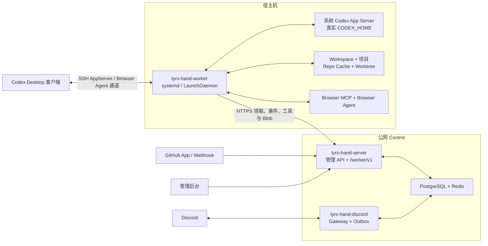

<p align="center">
  
</p>

<h1 align="center">Tyrs Hand</h1>

<p align="center"><a href="README.en.md">English</a></p>

[](https://github.com/slovx2/tyrs-hand/actions/workflows/ci.yml)
[](https://github.com/slovx2/tyrs-hand/actions/workflows/security.yml)
[](LICENSE)

Tyrs Hand 是连接 GitHub、Discord、Codex Desktop 与自有宿主机的自托管 Agent 协作平台。公网 Control 保存事件、权限和持久状态；宿主 Worker 使用机器用户真实的 Codex Home、项目目录和浏览器能力执行任务。

项目处于早期阶段，适合在受控仓库中评估。默认 GitHub Agent 可写 Worktree 并访问公网，接入生产仓库前请审查工具白名单、触发规则和权限策略。

## 架构


```mermaid
flowchart LR
    GitHub["GitHub App / Webhook"] --> Control
    Admin["管理后台"] --> Control
    Discord["Discord"] <--> Gateway
    subgraph Public["公网 Control"]
        Control["tyrs-hand-server\n管理 API + /worker/v1"]
        Gateway["tyrs-hand-discord\nGateway + Outbox"]
        State["PostgreSQL + Redis"]
        Control <--> State
        Gateway <--> State
    end
    subgraph Host["宿主机"]
        Worker["tyrs-hand-worker\nsystemd / LaunchDaemon"]
        Codex["系统 Codex App Server\n真实 CODEX_HOME"]
        Workspace["Workspace + 项目\nRepo Cache + Worktree"]
        Browser["Browser MCP + Browser Agent"]
        Worker <--> Codex
        Worker <--> Workspace
        Worker <--> Browser
    end
    Desktop["Codex Desktop 客户端"] <-->|"SSH AppServer / Browser Agent 通道"| Worker
    Worker -->|"HTTPS 领取、事件、工具与 Blob"| Control
```

主要进程：

- `tyrs-hand-server`：管理 API、GitHub App、Webhook、Worker API 和前端静态资源。
- `tyrs-hand-discord`：Discord Gateway、Forum、投影和 Outbox。
- `tyrs-hand-worker`：宿主常驻进程，运行 Codex、Git/SSH、Browser 和多客户端 Desktop 通道。
- `tyrs-hand-admin`：数据库迁移、管理员恢复、主密钥轮换和 GC。

PostgreSQL 是唯一权威状态源。Redis 只保存可重建的限流与通知状态。Worker 不直连数据库或 Redis。

## Worker 与 Workspace

一个 Worker 对应一个真实 OS 用户，并最多绑定一个 Workspace。Workspace 是逻辑资源，可包含多个自动发现的项目和 Discord Forum，不承载运行时配置。

- `HOME`、`CODEX_HOME`、Codex 登录态、Provider、Base URL、代理和模型目录均来自机器用户。
- 固定项目根目录为 `~/tyrs-hand/workspaces`，一级目录即项目。
- GitHub Work Item 使用宿主 Repo Cache 和独立 Worktree。
- Worker 的 SSH Server 支持多公钥、多客户端、PTY、SCP 和 SFTP，并将 Codex Desktop 接入同一个 AppServer Hub。
- Worker 生命周期内只启动一个 Codex App Server；Desktop 连接只是 Hub Session，任一客户端断开都不会重启或终止上游。机器 Codex 配置变更后通过重启 Worker 统一生效。
- 出站 SSH Credential 和 Host 由 Control 分配给指定 Worker；GitHub Token 不进入 Codex 环境或 Git Remote。

Codex CLI 固定为 `0.147.0`。Worker 启动与 `doctor` 会拒绝任何其他版本。

## Codex 配置边界

Control 不保存或下发 Provider、API Key、ChatGPT 登录态、Base URL、代理、`config.toml` 或 `auth.json`。

Control 中的“GitHub Agent 设置”只作用于 `github_work_item`：

- Agent Profile 和仓库覆盖可提供 model、reasoning、service tier、sandbox 与工具参数。
- 全局 GitHub Agent instructions 作为该次 GitHub Turn 的 developer instructions 注入，不写机器 Home。

Desktop、Discord 和 Mobile 不读取这些默认值；显式会话或 Turn 选择仍然有效，未指定项由机器 Codex Home 决定。初始标题使用回退文本，后续由 Codex 原生 `thread/name/updated` 事件更新。

## Browser

- Worker 任务直接访问宿主 Browser MCP 和受控宿主文件目录。
- Browser Token 只从 Worker 用户可读的受限文件读取，不进入 Control 或任务快照。
- Codex Desktop 通过 Worker 的 Browser Agent SSH 通道访问宿主浏览器。
- Worker 浏览器任务和多个 Desktop Browser 客户端可以并发；任一 Desktop 断开不会中断其他链路。

## 快速开始

完整步骤见[最小安装指引](docs/deployment/minimal-installation.md)。

### Control 依赖

- Docker Engine 与 Docker Compose
- PostgreSQL、Redis（示例 Compose 已提供）
- HTTPS 域名与反向代理

本地源码开发另外需要 Go `1.26.5`、Node.js `24.14.0`、pnpm `11.14.0` 和 Codex `0.147.0`。

```bash
cp .env.example .env
install -d -m 0700 .local/secrets
openssl rand -base64 32 > .local/secrets/master_key
openssl rand -hex 32 > .local/secrets/postgres_password
docker compose -f compose.yaml -f compose.production.yaml up -d postgres redis
docker compose -f compose.yaml -f compose.production.yaml --profile tools run --rm admin migrate
docker compose -f compose.yaml -f compose.production.yaml up -d server discord
```

打开 `/setup` 创建管理员并配置 GitHub App、Discord 和 Worker。随后使用一次性 Enrollment Token 安装宿主 Worker：

```bash
sudo env \
  TYRS_HAND_RELEASE_VERSION=v0.2.0 \
  TYRS_HAND_WORKER_CONTROL_URL=https://agent.example.com \
  TYRS_HAND_WORKER_ENROLLMENT_TOKEN=<one-time-token> \
  TYRS_HAND_WORKER_PUBLIC_KEYS_FILE=/path/to/authorized_keys \
  TYRS_HAND_WORKER_USER=<os-user> \
  sh deploy/worker/install.sh
```

安装脚本校验 SHA-256 与 Sigstore bundle，运行依赖检查，并安装 Linux systemd unit 或 macOS LaunchDaemon。精确依赖声明位于 `deploy/worker/dependencies.json`。

## Worker API

Worker 使用 Bearer Credential 直接访问单版本 REST API：

```text
POST /worker/v1/enroll
POST /worker/v1/heartbeat
POST /worker/v1/claims
GET  /worker/v1/workspace
POST /worker/v1/workspace/projects/snapshot
GET|POST /worker/v1/blobs/{id}
... Desktop、Thread、Turn、Run、Tool、Git 与 SSH 直连接口
```

协议没有 Envelope、RPC 路由映射或版本转发层。完整定义见 `api/openapi.yaml`。

## 管理后台

后台按六组组织：

1. 概览：Control、Worker、Codex、Browser、GitHub 和 Discord 健康状态。
2. Workers：注册、容量、依赖状态，以及内嵌 Workspace、项目与 Forum。
3. Clients：设备配对、状态与撤销。
4. Integrations：GitHub、仓库、规则、Discord 和 GitHub Agent 设置。
5. Access：出站 SSH Credential、Host 与 Worker 分配。
6. Operations：Work Item、Thread、Job、缓存和审计。

## 安全

- 管理员密码使用 Argon2id，Secret 使用 AES-256-GCM。
- Session 使用随机 Cookie，并启用 HttpOnly、SameSite 和 CSRF 防护。
- Webhook 经 Body 限制、HMAC-SHA256 验签和 Delivery ID 去重。
- Run 结果校验 Capability、租约 Token 和单调递增 Epoch。
- Dynamic Tool 校验 Installation、Repository、Work Item、工具白名单和实时 GitHub 权限。
- Worker API 支持 IP/CIDR allowlist，只信任配置过的代理来源头。
- 内置 SSH 只允许 session channel，不开放端口转发。

不要提交 `.env`、`.local/`、Codex Home、私钥、Worktree 或仓库缓存。

## 开发与发布

```bash
pnpm --dir web install --frozen-lockfile
make generate
make ci-local
```

Integration 测试用 Testcontainers 启动 PostgreSQL/Redis，并用满足最低版本的真实 Codex 与 Mock Responses 上游验证 App Server。Browser 验收需同时核对工具结果、宿主 Bridge、文件交换、任务记录、Projection 和 Outbox。

GitHub Actions 发布带 provenance、SBOM 和 keyless Cosign 签名的 Control 镜像，以及 Linux/macOS、amd64/arm64 Worker tarball、SHA-256 和 Sigstore bundle。生产应固定 Control Digest 和 Worker 精确版本，不使用 `latest`。

## License

[MIT](LICENSE)
