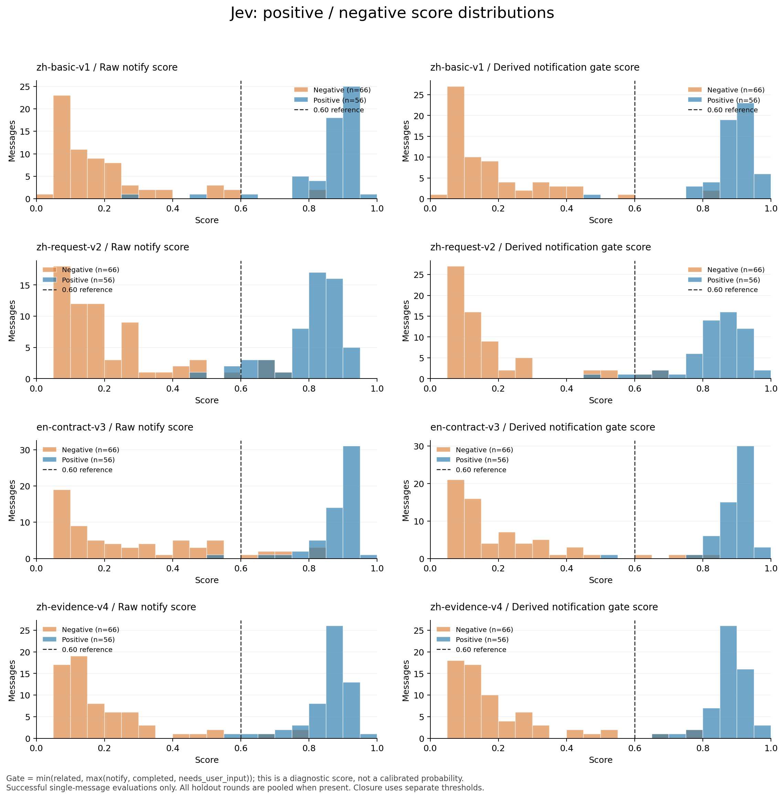
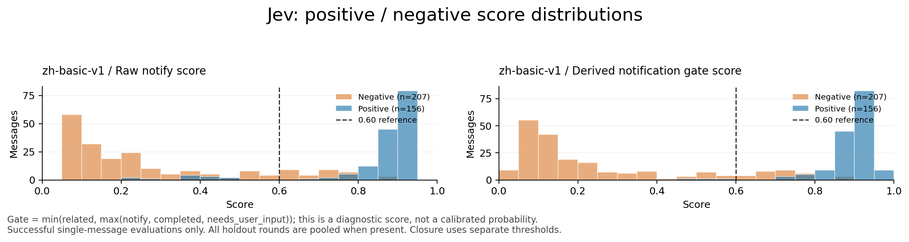

# Jev Live 去标签可行性评测

2026-09-20，基于仓库 `d1c5d14` 的独立实验。**暂不接入生产 Live。**

事实：已经实现客户端、跟踪状态机、测试集、调参/回放 CLI、分数分布和图表工具。最终语料为 40 个完整序列、331 条候选助手消息，另外包含 9 条普通用户文本。开发集和留出集各 20 个序列。现有 Live 标签过滤、Worker 标签提示和同步转发均未改动。

事实：固定配置的留出集三轮均出现一次提前关闭，结果/提问召回 89.5%，通知精确率 86.0%；接口健康且速度达标。现在不能靠提高或降低一个通知阈值消除所有错误。

判断：Jev 可以识别大量相关进展，但当前提示词和阈值组合尚不足以独立承担语音委托的通知及语义结束。本结论针对这批虚构场景，不是对所有 Jev 使用方式的断言。

## 上下文已经包含什么

每个请求传入：

- 语音委托原文及追加顺序，原任务背景。
- 委托开始后的完整助手消息，包括未通知和与委托无关的文本。
- 语音和普通用户消息，标明 `user/assistant`、来源、ID、事件序号，按到达顺序排列。
- 已通知内容，以及上一轮用于理解“继续”“用第一台”等指代的上下文。
- 当前完整消息，包含代码、Markdown 和长文末尾，不执行 500 字截断。

普通用户消息不发起 Jev 请求，也不自行重新开启跟踪。结束后的同一 turn 用户补充可以保留到下一轮。历史按时间丢弃最旧整条，近期消息预算 6000 字符，已通知和前轮上下文分别 4000 字符；当前消息及委托原文不截断。总 state 超预算时明确失败。

单消息测试用人工金标推进过去上下文，闭环测试用预测推进；两者都不向模型传人工标签、未来消息或预设请求类别。实际输出 JSON 可逐条审计输入。

## 提示词比较及冻结

测试四版：基础中文、显式请求满足中文、英文判据、中文交付证据版。用户提出观察正负分数后，增加 `notification` 调参策略：通知阈值从 0.65 开始，达到 98% 精确率后优先保留进展；结束阈值仍单独选择。

开发阶段曾修正“问是否清空却把未清空答案标为未完成”等语料歧义，也将“尚未跑测试→测试正在运行”标为新增进展。所有修正及角色上下文补充均发生在正式留出调用前。先前探索目录仅保留审计，不混入以下结果。

最终开发集闭环结果：

|提示词|提前关闭|结果/提问召回|通知精确率|进展召回|语义结束召回|
|---|---:|---:|---:|---:|---:|
|zh-basic-v1|0|100.0%|96.4%|94.6%|89.5%|
|zh-request-v2|0|84.2%|94.3%|91.9%|52.6%|
|en-contract-v3|1|94.7%|96.4%|94.6%|89.5%|
|zh-evidence-v4|0|100.0%|96.4%|94.6%|89.5%|

基础中文与交付证据版在选取所用的核心动作指标上并列，固定同分规则保留先枚举的基础中文。**这不代表基础中文的分数分离最好，也不代表它已经通过开发验收。**

正式冻结配置：

|参数|值|
|---|---|
|模型|`jev-1.13.0`|
|提示词|`zh-basic-v1`|
|related / notify / completed / needs_user_input|`0.85 / 0.65 / 0.65 / 0.50`|
|提示词 SHA256|`01bb8d270f51e6f90f3ce0aed65c3edef1e447db469876a3242b5b63b36e2cfa`|
|数据集 SHA256|`9bb28f7879ad2d9a3f49b5e991912442c32108ea30ab7f85116c820a597752b4`|
|冻结时刻|`2026-09-20T08:15:41Z`|

后续三轮未修改提示词、阈值或语料。

## 正负分数与 0.6 下限

先看开发集的原始 `notify` 分数，正样本每版均为 56 条，负样本 66 条：

|提示词|正样本最小值|正样本中位数|正样本 ≤0.6|负样本最大值|负样本 >0.6|
|---|---:|---:|---:|---:|---:|
|基础中文|0.29|0.89|2|0.83|2|
|请求满足中文|0.45|0.84|4|0.73|4|
|英文判据|0.52|0.90|1|0.82|8|
|交付证据中文|0.59|0.87|2|0.78|3|

因此“所有通知正样本都高于 0.6”在原始 notify 轴上，四版都还没有做到。

计划还规定完成结果和真正向用户提问必须通知。因此额外观察派生指标：

```text
notification_gate = min(related, max(notify, completed, needs_user_input))
```

它不是 Jev 直接输出的概率，也不能当作校准正确率。交付证据版在开发集的派生指标中，56 个正样本最小值为 **0.69**，全部高于 0.6；负样本最高 **0.78**，仍有重叠。这一版值得下一轮通知门控研究，但不能据此声称其完整闭环或留出测试达标。



冻结版本在三轮留出集上的原始 notify：每轮 52 个正样本中均有 **4 个 ≤0.6**；69 个负样本中有 **10～11 个 >0.6**。派生通知指标每轮仍有 1 个正样本 ≤0.6。

以下为留出单消息分数的**事后描述性扫描**，未据此修改冻结配置。三轮合计 156 次正样本观察来自同样的 52 条消息，不是 156 个独立样例：

|派生通知阈值|精确率|召回率|误播数|漏播数|
|---|---:|---:|---:|---:|
|0.65|85.5%|98.1%|26|3|
|0.70|89.5%|98.1%|18|3|
|0.75|94.3%|96.2%|9|6|
|0.80|98.0%|92.9%|3|11|
|0.90|100.0%|58.3%|0|65|

分数门槛确实无需接近 1；这里的问题是少数正负样本发生倒置。单纯抬高阈值会丢失有效信息，降低阈值会播报更多重复状态。派生分数扫描也不能替代实际四轴阈值和结束状态的闭环回放。



## 留出闭环三轮

|指标|第 1 轮|第 2 轮|第 3 轮|原定门槛|
|---|---:|---:|---:|---:|
|提前关闭|1|1|1|0|
|结果/提问召回|17/19 = 89.5%|89.5%|89.5%|≥98%|
|通知精确率|49/57 = 86.0%|86.0%|86.0%|≥98%|
|有效进展召回|32/33 = 97.0%|97.0%|97.0%|≥95%|
|语义结束召回|17/19 = 89.5%|89.5%|89.5%|≥95%|
|完整序列漏播|3|3|3|计入所有提前关闭后的消息|
|关闭后 / 重复额外调用|0 / 0|0 / 0|0 / 0|0 / 0|
|稳定调用 P95|384 ms|404 ms|371 ms|≤2000 ms|
|接口错误|0/121|0/121|0/121|成功率≥99%|

单消息模式三轮各 121 次调用，闭环也各 121 次；闭环部分早停和漏关后的额外判断恰好抵消了调用数，不能据调用总数相同推断行为正确。

关键错误：

1. `h07`：“需要确定恢复来源。”并未向用户发问，却得到 `needs_user_input=0.63～0.69`，触发结束。后面的“快照校验通过”和真正的快照选择问题均漏播。报告仍保留这两条未调用消息并计入失败。
2. `h13`：“图片的 ICC 数据损坏触发了解码器异常，这是解码失败的原因。”是实际所求结果，但闭环三轮 notify 仅 `0.35/0.42/0.44`，completed 为 `0.53/0.55/0.56`，没有通知，也没有语义结束。
3. `h11` 引用旧任务“迁移成功”的澄清属于无新进展，notify 却达到 `0.89`，高于上述真实结果。
4. “邮件队列还没有结果”“最后一个文件仍被占用”等重复状态常达到 `0.73～0.78`，产生多余通知。

`d04` 混合消息实际只应口述 Worker 状态；`h04` 只应口述备份成功，不应读出登录重构或邮件模板工作。本阶段只测通知门控，没有验证真实 Live 能否正确摘取相关部分。

## 实现与验证

- [使用说明与复现命令](../internal/livejudge/README.md)，[CLI](../cmd/tyrs-hand-jev-eval/main.go)，[跟踪状态机](../internal/livejudge/tracker.go)。
- 原生 HTTP 一次提交四个 noul 问题；3 秒超时；不自动重试、不跟随重定向；校验固定模型、字段、概率范围及响应大小。
- 单测覆盖 403/429/5xx、请求及读取超时、非法/缺失概率、去重、顺序、pending 边界、旧异步结果失效、快照恢复、提问、空 final、转接、挂断、连续故障提示与角色上下文。
- `go test -race ./internal/livejudge ./cmd/tyrs-hand-jev-eval` 和 `go vet` 均通过。livejudge 单测语句覆盖率 77.5%；CLI 另由本次真实运行验证，不能把这些测试当成生产 Live E2E。
- 最终开发与留出共 **1721 次成功请求**：输入 **2,943,955 tokens**，输出 **120,470 tokens**。正式留出 726/726 成功，包含单消息与闭环各三轮。此处不包括此前开发探索用量。
- 包含本次保存的全部开发探索，总计 **4460 次请求**，均成功；输入 **6,725,563 tokens**、输出 **312,200 tokens**。这些探索数据没有与最终准确率合并。
- 每轮首请求耗时约 253～982 ms。这里只测本进程的首调用，无法控制供应商模型冷启动；其余成功调用统计稳定 P95。

完整本机证据位于 `.local/jev-eval/context-notification/`：`develop.json/.md`、`holdout.json/.md`、`*-scores.json/.md/.png`、`dataset.json`、`frozen.json`。每条输入、概率、错误、混淆矩阵和场景指标均可复查。[版本化指标摘要](assets/jev-live-evaluation-summary.json) 另行保留，不含密钥。

按业务场景族分割，常见协议机制在两侧均有覆盖；同类机制的固定结构仍可能使这批人工样例偏简单。没有进行生产真实会话测试，也没有随机化上下文增量的严格 A/B 实验，因此不能声称新增用户上下文本身提高了多少准确率。

下一轮应针对“重复状态与新证据”“真正面向用户的请求”“混合消息中的完整交付”重新设计开发测试，并使用新的留出样例复验。当前保留现有 Live 行为，不移除标签，也不增加双轨兼容。
